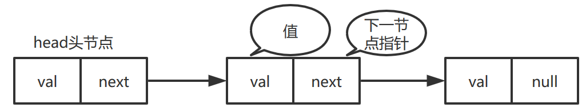
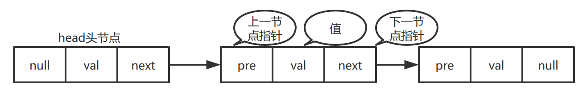

# 链表

### 什么是链表？
链表是一种数据结构，它在存储单元是一种非逻辑、非顺序的存储结构，但是它的数据元素的存储是有序的（通过指针实现）。链表（单向链表）由一系列节点（Node）组成，每个节点包含元素以及下一节点的指针两个部分（单向链表）。如图：
  
### 单向链表怎么使用Java去实现呢？
使用Java实现单向链表其实不难，只需要实现上图的数据结构即可。
```java
public class Node {

    /**
     * 数据域
     */
    public int data;

    /**
     * 指针域，指向下一个节点
     */
    public Node next;

    public Node() {

    }

    public Node(int data) {
        this.data = data;
    }

    public Node(int data, Node next) {
        this.data = data;
        this.next = next;
    }
}
```
Java实现单向链表就这么简单。
### 什么是双向链表？
顾名思义，双向链表具有双向性，即每个节点都有一个指针指向前一个节点。值得一提的是Java中的LinkedList的底层数据结构就是双向链表。如图：

### 双向链表怎么用Java去实现？
双向链表的实现只需要在单向链表的前提下加上前节点的指针域即可。
```java
public class DNode {

    /**
     * 数据域
     */
    public int data;

    /**
     * 指针域，指向下一个节点
     */
    public DNode next;

    /**
     * 指针域，指向上一个节点
     */
    public DNode pre;

    public DNode() {

    }

    public DNode(int data, DNode next) {
        this.data = data;
        this.next = next;
    }

    public DNode(DNode pre, int data) {
        this.pre = pre;
        this.data = data;
    }

    public DNode(int data, DNode next, DNode pre) {
        this.data = data;
        this.next = next;
        this.pre = pre;
    }
}
```
实现了双向列表，那么双向循环链表也很简单。只需要在双向链表的头节点添加尾节点的指针，和在尾节点添加头节点的指针，就可以形成一个闭环。