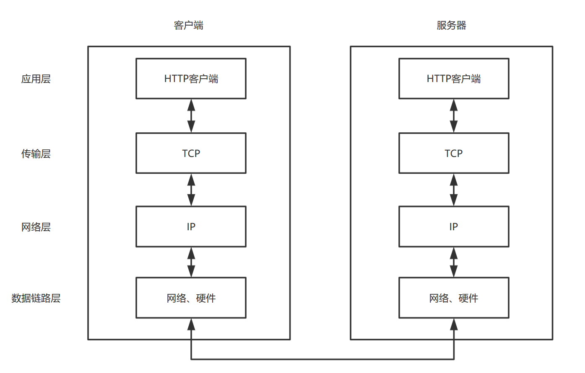
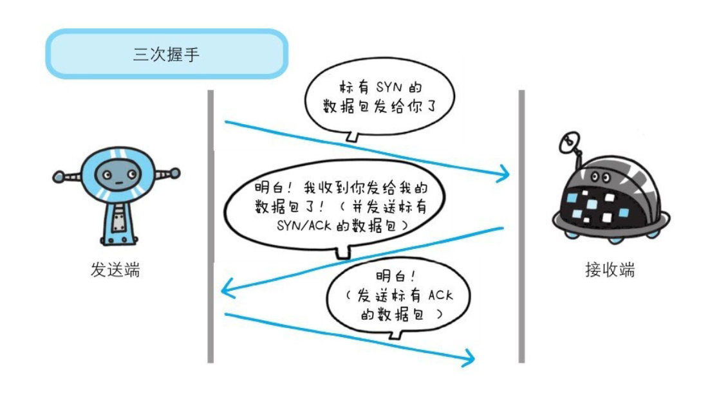
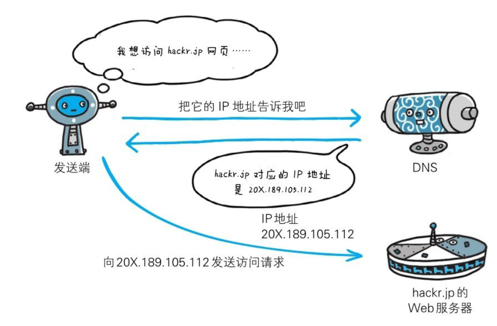
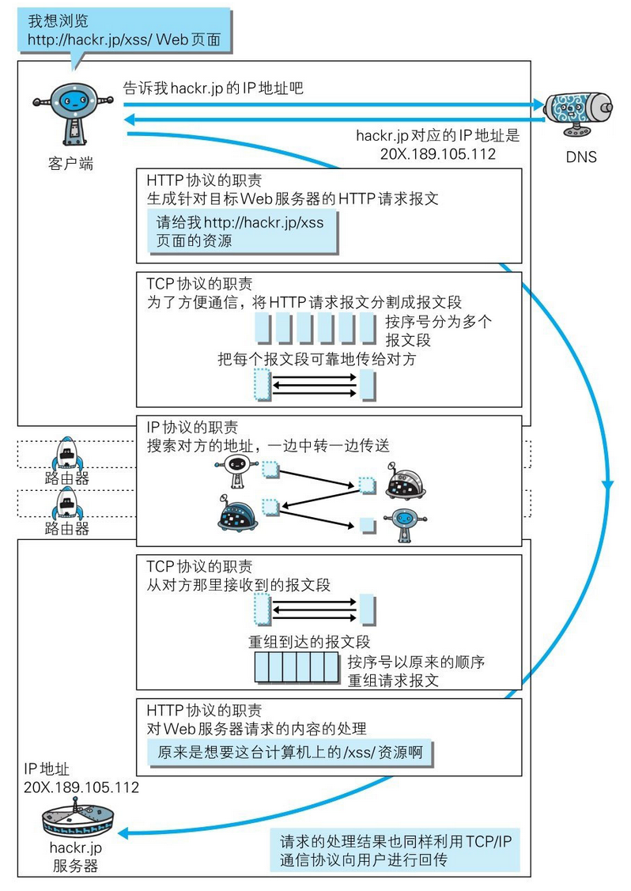
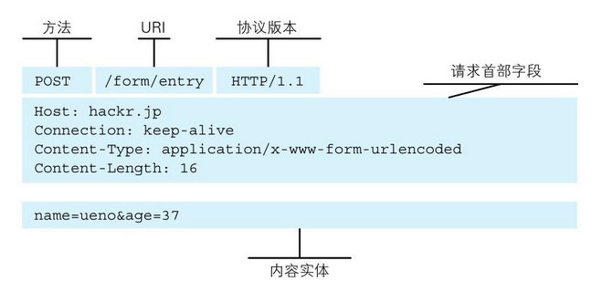
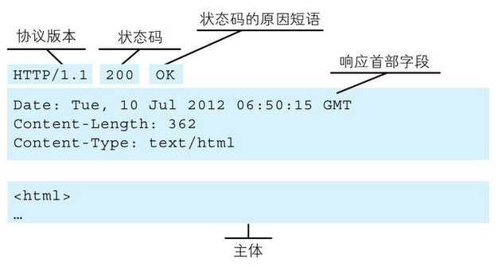

## 计算机网络

### TCP/IP协议族
通常使用的网络（包括互联网）是在TCP/IP协议族的基础上运作的。TCP/IP包括但不限于TCP、IP协议，并不是两者的总和。TCP/IP是互联网相关的各类协议族的总称。

### TCP/IP的分层管理
分为一下四层：应用层、传输层、网络层和数据链路层。分层的好处就是如果某一层有变动，只需要把部分替换掉，而不需要整个替换。而应用层上的应用可以只考虑分派给自己的任务，无需考虑传输路线等问题。
TCP/IP协议族各层的作用如下：  
- 应用层：向用户提供应用服务时的通信活动，其中FTP（文本传输协议）和DNS(域名系统)服务以及HTTP协议也处于该层。
- 传输层：对应上层应用层，提供处于网络连接总的两台计算机之间的数据传输，传输层有两个性质不同的协议：TCP（传输控制协议）和UDP（用户数据报协议）。
- 网络层：处理网络上流动的数据包（网络传输的最小单位）。该层规定了传输路线，并把数据包传送给对方，即在众多选项中选择一条传输路线。
- 数据链路层：用来处理网络的硬件部分，包括操作系统、驱动、网卡等。

### TCP/IP通信传输流
 
发送端自上而下，接收端自下而上传输

### IP协议
IP（网际协议）位于网络层，作用是把各种数据包传送给对方。IP地址和MAC地址是保证确实传送给对方的必要条件。
IP地址指明了被分配到的地址，可变。MAC地址是指网卡所属的固定地址，不可变。

### TCP协议
TCP位于传输层，提供可靠的字节流服务。字节流服务指，为了方便传输，将大块数据分割成以报文段为单位的数据包进行管理。而TCP是可靠的，能够确认数据最终是否送达到对方。  
三次握手，过程使用SYN(synchronize)和ACK(acknowledgement)作为标识：
1. 发送端 发送 带有SYN标志的数据包给接收端
2. 接收端收到数据包，回传带有SYN/ACK标志的数据包表示确认信息
3. 发送短短再回传一个带ack标志的数据包，表示握手结束

如果再握手中某个阶段中断，TCP协议会再次以相同的顺序发送相同的数据包。

### DNS服务
DNS(域名系统)服务位于应用层，提供域名到IP之间的解析服务。用户通常使用主机名或域名来访问对方的计算机，而不是直接通过IP地址访问。
但是计算机擅长处理一长串数字。DNS协议提供通过域名查找IP地址，或逆向从IP地址反查找域名的服务。

### 访问网页的过程

### URI和URL
URI（Uniform Resource Identifier，同意资源标识符），用字符串表示某一互联网资源，例如：ftp://ftps.is/rc/123.text。
URL（Uniform Resource Locator,统一资源定位符），网址。

### HTTP
HTTP用于客户端和服务器端之间的通信，通过请求和响应达成通信。HTTP是无状态协议，自身不对请求和响应之间的通信状态进行保存。
为了保存状态的功能，引入了Cookie技术。
请求报文由请求方法、请求URI、协议版本、可选的请求首部字段和内容实体构成

响应报文由协议版本、状态码、原因短语、乡音首部字段和响应实体构成

补充：在HTTP的初始版本中，每次HTTP通信就要断开一次TCP连接。
后来的HTTP/1.1和一部分HTTP/1.0想出来持久连接的方法，只要任意一方没有提出断开，
则保持TCP连接状态，即剋多次发送HTTP请求。
持久连接的好处在于减少了TCP连接的重复建立和断开的开销，减轻了服务器的负责，同时节省了时间。
但是一个请求一个响应的方式效率仍然地下，后来就出现了管线化的发送方式，就像非阻塞。无需等待响应即可发送下一个请求。

### HTTP请求方法
* GET请求：获取资源
    * 请求访问已被URI识别的资源
* POST请求：传输实体主体
* PUT请求：传输文件
    * 由于HTTP/1.1的PUT方法自身不带验证机制，所以比较少用
* DELETE请求：删除文件
    * 由于HTTP/1.1的DELETE方法自身不带验证机制，所以比较少用
* HEAD：获得报文首部
    * 与GET一样，但不反悔报文主体部分
* OPTIONS：询问支持的方法
    * 查询针对请求URI指定的资源支持的方法